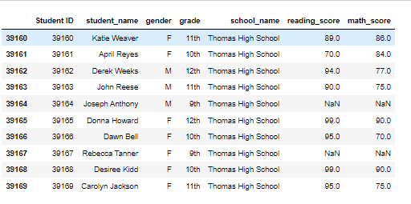
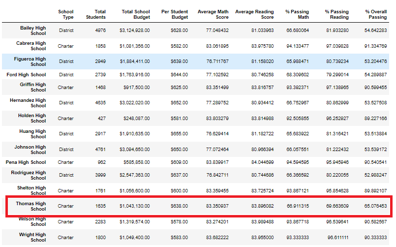

# PyCitySchool Challenge

## Overview and Purpose
Fabio Lima, the chief Data Scientist for the city schools district, initiated a project to analyze data on various schools' performance and provide insights to the School Board on performance trends and patterns. The analysis focused on each school's performance data, including math and reading scores, per-student budgets, school type, and school size. The insights gathered from this analysis will assist the state and district School Boards in making strategic decisions about budget allocations for the upcoming year.

However, after the initial analysis was submitted to the School Board, they suspected academic dishonesty related to the math and reading grades at Thomas High School. To address this issue, the grades for Thomas High School's ninth-graders in math and reading were replaced with NaNs, while keeping the rest of the dataset unchanged. The analysis of the school district data was then repeated.

## Results

#### District Summary
Replacing the math and reading scores for Thomas High School's ninth-graders with NaN did not result in any significant changes at the district level. 

- The total number of students and budget remains the same.
- The average math score has slightly decreased from 79% to 78.9%, while the average reading score has remained the same.
- The percentage of students passing math has decreased from 75% to 74.8%.
- The percentage of students passing reading has decreased from 86% to 85.7%. 
- The overall passing percentage has decreased from 65% to 64.9%.

#### School Summary
o summarize each school's performance, we calculated the total number of students, total budget, per-student budget, average math score, average reading score, percentage passing math, percentage passing reading, and percentage overall passing for all schools. However, we excluded the ninth-grade students from Thomas High School whose scores were changed to NaN.

- The total new student count was 38,709
- The % Passing Math column values have changed from 93.27% to 66.91% for Thomas High School
- The % Passing Reading column values have changed from 97.31% to 69.66% for Thomas High School
- The % Overall Passing column values have changed from 90.95% to 65.08% for Thomas High School

These findings suggest that when the ninth-grade students of Thomas High School are removed and the school performance is recalculated based on the new student count, there is a significant decrease in Thomas High School's performance compared to other schools.

#### Top 5 schools:

Upon replacing the math and reading scores of Thomas High School's ninth graders with NaN and analyzing the data based on the new student count, which excludes these students, we observe that Thomas High School has dropped from its previous second place position. Instead, Griffin High School has taken its place.

#### Bottom 5 schools:

The replacement of scores for the ninth-grade students at Thomas High School had no impact on the performance of the five lowest-performing schools.

#### Math & Reading Scores By Grade

The per_school_summary_original_df dataframe examines the data after we replaced the ninth-grade math and reading scores with NaN, but we have not yet updated the school summary dataframe with the new passing percentages for 10th to 12th graders at Thomas High School, as instructed in steps 5 to 12. In this scenario:

- Math by grade score shows NaN for Thomas High School 9th graders.

- reading by grade also shows NaN for Thomas High School 9th graders.

#### Scores By School Spending

In terms of spending range per student, the schools whose per student budget ranges between $631 - $645 were affected.

- % Passing Math reduced from 73% to 67% 
- % Passing Reading reduced from 84% to 77% 
- % Overall Passing reduced from 63% to 56%

#### Scores By School Size

In terms of school size, there were no changes in scores for small and large schools.Only the scores for medium schools have been affected.

- % Passing Math reduced from 94% to 88%
- % Passing Reading reduced from 97% to 91% 
- % Overall Passing reduced from 91% to 85%

#### Scores By School Type

In terms of school type, only the scores at Charter level have been affected while the District level remains unchanged.

- %Passing Math reduced from 94% to 90%
- % Passing reading reduced from 97% to 93%
- % overall Passing reduced from 90% to 87%

#### Summary

Based on our analysis, we can conclude that while Thomas High School's performance appears consistent when analyzing data for grades 10 to 12, there is a significant decline in their overall performance relative to other schools when excluding data for their 9th-grade students. As a charter school, Thomas High School's performance decline reflects a trend seen across charter schools, although their overall average performance remains higher than district schools. 

When considering school size, we observe a decline in performance for medium-sized schools, even though their overall average performance is better than that of larger schools. Furthermore, the data suggests that schools with the lowest budget per student have the highest overall performance on average. Cabrera High School ranks first in overall performance, while Johnson High School has the lowest overall passing rate on average.

